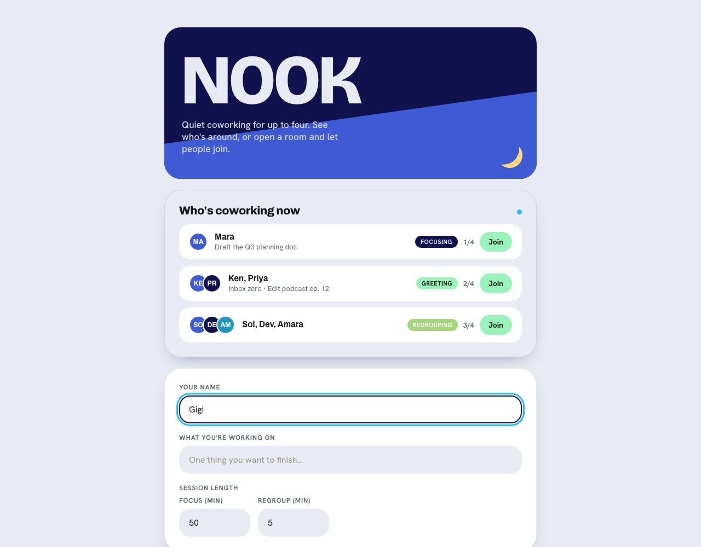
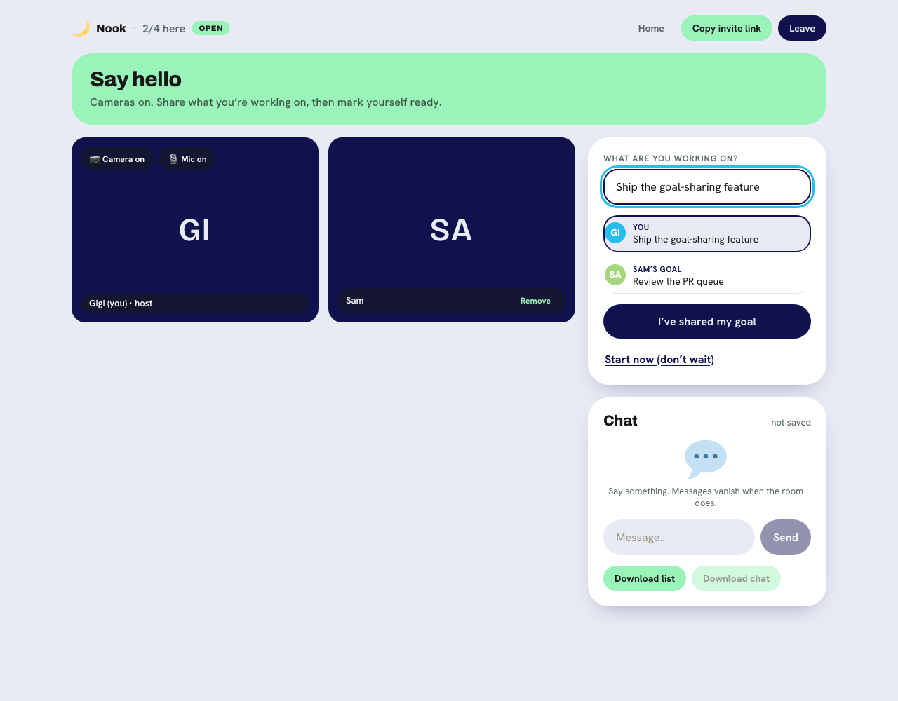
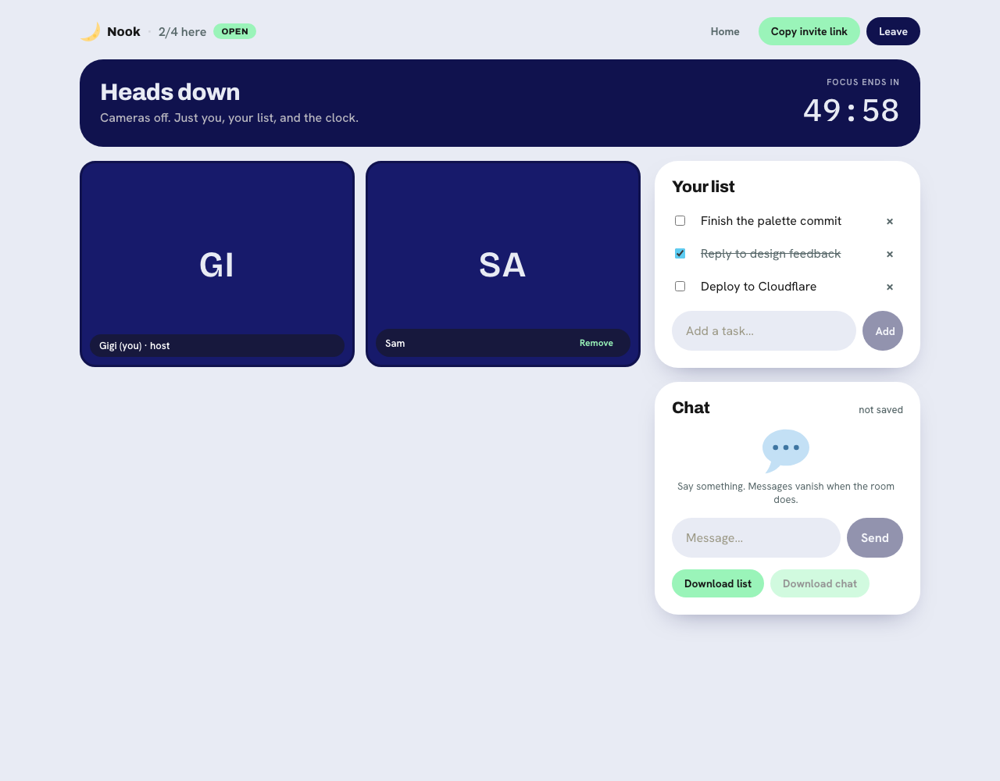
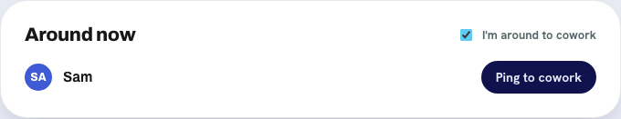
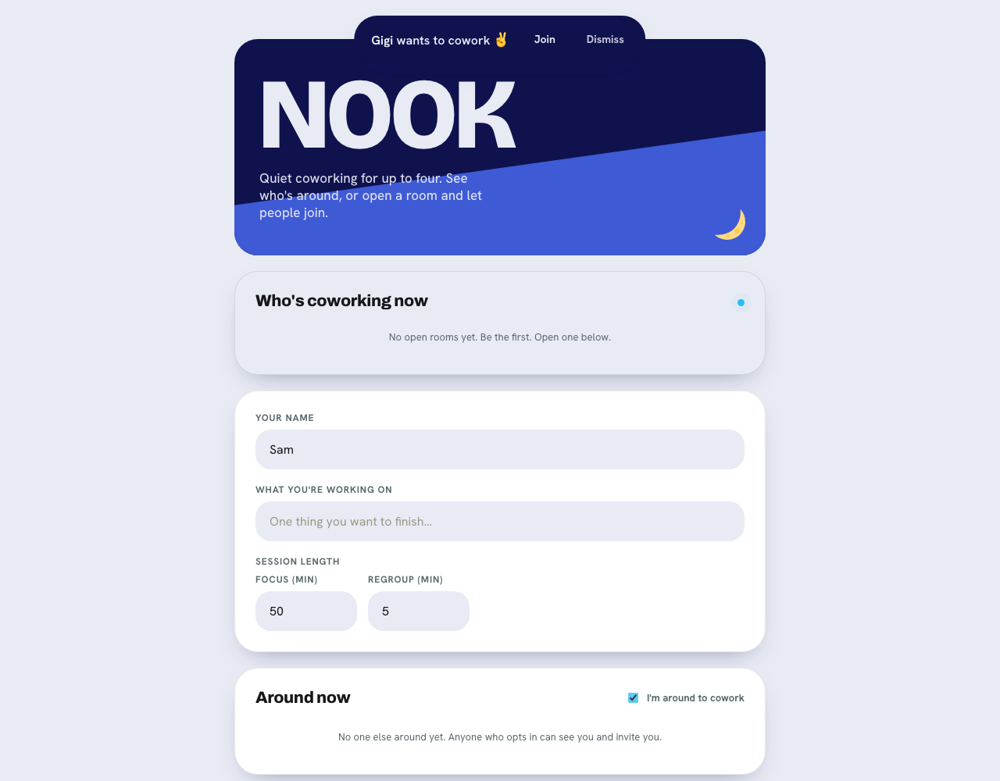
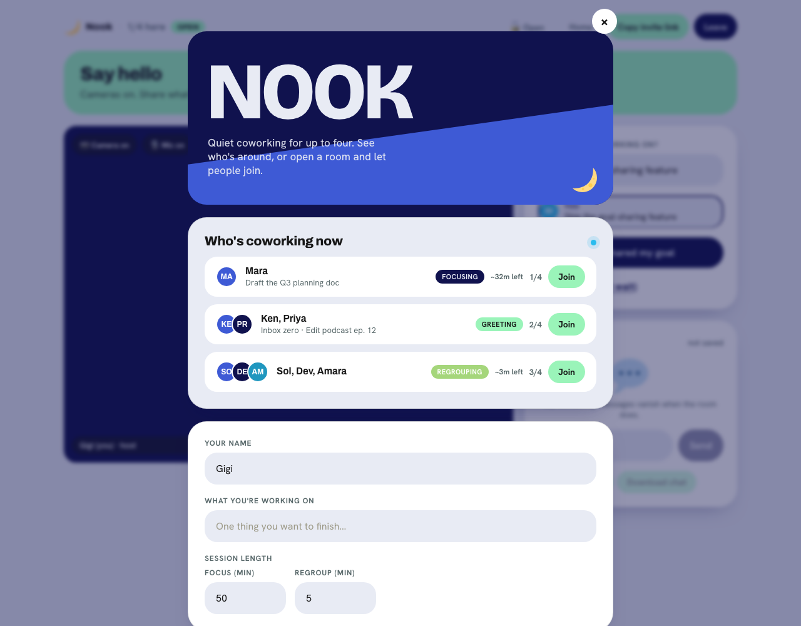

<div align="center">

# 🌙 Nook

### Quiet virtual coworking for up to four people.

Show up, say what you're working on, work heads-down alongside each other, then
regroup. No account, no downloads, nothing saved. Inspired by Groove.

**[→ Open Nook](https://nook.gigikenneth.workers.dev)**

<br>



</div>

---

## What is this?

Working alone is hard. Nook gives you the quiet company of a few other people
working at the same time: you can see each other, say what you're each trying to
get done, then go heads-down together for a focused stretch. It's like sitting at
a shared table in a library, not a video call.

A room holds **four people, max**. That's on purpose. Small enough that everyone's
presence actually matters.

## How a session works

A session moves through three short phases, together, on a shared timer:

| Phase | Cameras | What happens |
|:--|:--|:--|
| 🟢 **Greet** | On | Say hi. Type what you're working on. Everyone shares in turn, then marks themselves ready. |
| 🔵 **Focus** | Off | Heads-down. Just your to-do list and a shared countdown (50 min by default). |
| 🟣 **Regroup** | On | See what got done. Run another round, or head out. |

You control your **own mic and camera** at any time, and you can **add, edit,
check off, or delete tasks** on your list mid-session.

<table>
<tr>
<td width="50%"><br><em>Greet: share what you're working on, in turn.</em></td>
<td width="50%"><br><em>Focus: heads-down with a shared timer and your list.</em></td>
</tr>
</table>

## Join someone, or start your own

The home screen shows a **live directory** of open rooms: who's around, what
they're working on, and how long a session has left. Join anyone with a free
seat, even mid-session — you'll drop into whatever phase they're in and wrap up
together. Hosts can **lock** their room to keep it to the current group, or leave
it **open** so latecomers can join.

Or start your own:

- **Open room** — listed in the directory, anyone can join (up to 4).
- **Invite only** — private and unlisted; share the link yourself.

There's a lightweight **chat** during the session, and one-tap **Download list**
or **Download chat** if you want to keep anything.

## Find someone to cowork

Flip on **"I'm around to cowork"** and you'll show up in the **Around now** list
for anyone else who's opted in. See someone you'd like to work alongside? **Ping**
them: it opens a room and sends them an invite they can join with one tap. It's
opt-in only, and you drop off the list the moment you're in a session.

<table>
<tr>
<td width="50%"><br><em>See who's around and ping them.</em></td>
<td width="50%"><br><em>Get pinged, join with one tap.</em></td>
</tr>
</table>

## Peek without leaving

In a session and curious what else is happening? Tap **Home** in the room header
to open the full home screen as an overlay — browse the directory, see who's
around — while your session keeps running underneath. Close it and you're right
back in.

<div align="center">

</div>

## Your privacy

Nook stores **nothing**. No account, no database, no analytics.

- Your name and to-do list live only in your browser and in the room's memory.
- Chat is relayed live and never saved — the history disappears when the room does.
- Video is **peer-to-peer** (it never touches a server).
- When everyone leaves, the room simply ceases to exist.

## FAQ

**Do I need an account?** No. Type a name and you're in.

**Is my video recorded?** No. Video is a direct peer-to-peer connection between
the people in the room. Nothing is stored or passed through a server.

**What if my camera won't connect?** Nook uses a public STUN server and no TURN
relay yet, so a small number of people on strict networks won't get video
through. Presence, the timer, chat, and your list all still work.

**Can more than four people join?** No — four is the cap, by design.

**Is it really free?** Yes. It runs entirely on free infrastructure. See
[docs/DEPLOYMENT.md](docs/DEPLOYMENT.md) if you want to run your own.

## Run it yourself

Nook is open source (MIT). You can run it locally or deploy your own copy for
free on Cloudflare.

- **[Development guide](docs/DEVELOPMENT.md)** — local setup, project layout, how to contribute.
- **[Architecture](docs/ARCHITECTURE.md)** — how it works, the signaling protocol, the data model.
- **[Deployment guide](docs/DEPLOYMENT.md)** — ship your own in one command, custom domains, adding TURN.

Quick start:

```bash
git clone https://github.com/gigikenneth/nook.git
cd nook
npm install && npm run dev            # signaling Worker on :8787
cd web && npm install && npm run dev  # web app on :5173
```

Open http://localhost:5173. (Both processes need to be running.)

## License

MIT. See [LICENSE](LICENSE). Emoji art is [Twemoji](https://github.com/jdecked/twemoji)
(CC-BY 4.0), vendored in `web/public/twemoji/`.
